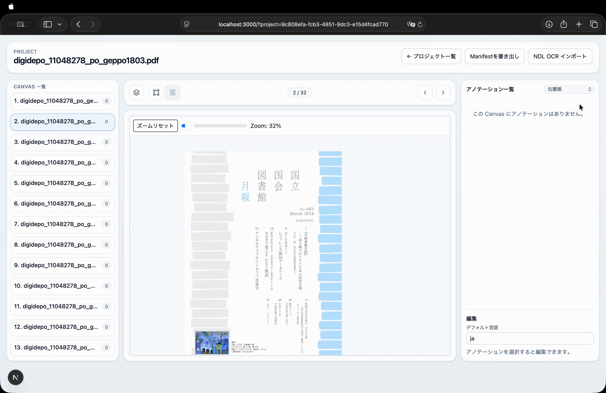

# IIIF Annotator

IIIF Presentation API v3 Manifest に対してテキスト文字起こしアノテーションを作成・編集する Web アプリです。
`npx` でローカル起動し、ブラウザ上で操作できます。



## 使い方（npx）

Node.js 18 以上が必要です。

```bash
npx iiif-annotator
```

ブラウザで http://localhost:3000 を開いて利用してください。

### オプション

| オプション | 説明 | デフォルト |
|---|---|---|
| `--port=<n>` | ポート番号 | `3000` |
| `--data=<dir>` | データ保存ディレクトリ | `~/.iiif-annotator` |
| `--open` | ブラウザを自動で開く | — |
| `--help` | ヘルプを表示 | — |

```bash
# ポートとデータディレクトリを指定してブラウザも自動オープン
npx iiif-annotator --port=3001 --data=/path/to/data --open
```

## 機能

### プロジェクト管理

- プロジェクト一覧の表示（作成日時・最終更新日時）
- プロジェクトの再開・削除（削除前に確認ダイアログ）
- 新規プロジェクト作成（以下の入力経路から選択）

### コンテンツ読み込み

- **IIIF Manifest URL** — リモートの manifest を URL 指定で読み込む
- **Manifest JSON ファイル** — ローカルの `manifest.json` をアップロード
- **画像・PDF ファイルのアップロード** — JPEG・PNG・PDF を複数選択してアップロードすると IIIF manifest を自動生成
  - PDF はサーバーサイドで各ページを PNG 画像に変換（PDFium 使用、2x スケールで高品質変換）
  - Canvas の画像 URI はローカルサーバーのパスを使用

### 画像表示・アノテーション編集

- ズームスライダー（20%〜200%、マウスホイールでも操作可）・ズームリセットボタン
- Bbox 選択中にズーム操作すると Bbox の中心を基点にズーム
- アノテーション一覧からアノテーションをクリックすると、そのアノテーションの中心にアニメーション付きでパン
- Canvas 切り替え時にズームレベルを維持（オフセットのみリセット）
- 編集モード（矩形描画）・閲覧モードをツールバーボタンまたはキーボードで切り替え
- マウスドラッグで矩形アノテーションを作成
- 矩形の移動・リサイズ（8 方向ハンドル）
- テキスト入力・言語コード（`xml:lang`）の設定
- アノテーション一覧（ソート順：Y 座標 / 信頼度昇順 / 信頼度降順）
- 信頼度スコアをカラーバッジ（緑 ≥90% / 黄 ≥70% / 赤 <70%）とプログレスバーで表示
- アノテーション操作後に自動保存（500ms デバウンス）

### サムネイルパネル

- サムネイル一覧パネル（現在 Canvas をハイライト）
- ツールバーボタンでパネルの表示／非表示を切り替え可能
- 前後ページボタン・キーボードショートカット（← →）
- 現在ページ数 / 総ページ数の表示

### キーボードショートカット

| キー | 動作 |
|---|---|
| `←` / `→` | 前後の Canvas へ移動 |
| `R` | 編集モード（矩形描画）へ切り替え |
| `P` | 閲覧モードへ切り替え |
| `X` | 選択中のアノテーションを削除 |
| `Delete` / `Backspace` | 選択中のアノテーションを削除 |
| `Ctrl+D` / `Cmd+D` | 選択中のアノテーションを複製（10px オフセット） |

各ショートカット（R / P / X キー）は設定画面で個別に有効／無効を切り替えられます。

### 設定

- **セーフデリート** — ON のとき削除操作（X キー・Delete キー・削除ボタン）で確認ダイアログを表示
- キーボードショートカット（R / P / X）の個別有効／無効切り替え
- **OCR スキーマ管理** — カスタム OCR スキーマの作成・編集・削除（BBox 形式・Canvas マッチング方法・JSON Schema を設定）

### OCR JSON インポート

- 任意の OCR ツールが出力する JSON からアノテーションを一括インポート
- ツールバーのスキーマ選択ドロップダウンでインポート形式を切り替え
- 複数の JSON ファイルをまとめてアップロードし、Canvas に自動マッチング
- 信頼度スコアをアノテーションに保存し、一覧表示・ソートに利用
- **NDL OCR** 形式は組み込みスキーマとして標準対応（NDLOCR-Lite 出力に対応）
- カスタムスキーマを設定画面で自由に追加・編集・削除

**対応 BBox 形式:**

| 形式 | 説明 |
|---|---|
| `quad` | 4頂点配列 `[[x,y],[x,y],[x,y],[x,y]]` |
| `xywh-array` | 配列 `[x, y, w, h]` |
| `xywh` | 個別フィールド（x / y / w / h） |
| `ltrb` | 個別フィールド（left / top / right / bottom） |

**Canvas マッチング方法:**

| 方法 | 説明 |
|---|---|
| 自動 | ファイル名ラベル一致 → 末尾番号の順で試行 |
| ファイル名ラベル | Canvas ラベルと JSON ファイル名（拡張子除く）を完全一致 |
| ファイル名末尾番号 | `_NNNNN` の連番で Canvas インデックスに対応（0始まり／1始まりを選択可） |
| JSON 内フィールド | JSON 内の指定パスの値を Canvas ラベルと照合 |

### エクスポート

- アノテーション埋め込み済み IIIF Presentation API v3 準拠 manifest を JSON-LD 形式でダウンロード
- 各 Canvas の `AnnotationPage` を `annotations` フィールドに埋め込んだ単一 JSON ファイルとして出力

## データ保存先

デフォルトのデータ保存先は `~/.iiif-annotator` です。`--data` オプションまたは環境変数 `IIIF_DATA_DIR` で変更できます。

```
~/.iiif-annotator/
  projects/
    [project-uuid]/
      meta.json          # プロジェクトメタ情報
      manifest.json      # IIIF manifest
      annotations/
        [canvas-index].json  # Canvas ごとの AnnotationPage
  uploads/
    [project-uuid]/
      [filename]         # アップロード・変換された画像ファイル
  ocr-schemas/
    [schema-uuid].json   # カスタム OCR スキーマ定義
```

## REST API

ローカルサーバー (`http://localhost:3000`) が提供する JSON API です。MCP サーバーや外部ツールからの操作に利用できます。

### プロジェクト

| メソッド | パス | 説明 |
|---|---|---|
| `GET` | `/api/projects` | プロジェクト一覧を取得 |
| `POST` | `/api/projects` | プロジェクトを新規作成 |
| `GET` | `/api/projects/:id` | プロジェクト詳細（manifest・アノテーション込み）を取得 |
| `PUT` | `/api/projects/:id` | プロジェクトの manifest・名前を更新 |
| `DELETE` | `/api/projects/:id` | プロジェクトを削除 |

### OCR スキーマ

| メソッド | パス | 説明 |
|---|---|---|
| `GET` | `/api/ocr-schemas` | カスタムスキーマ一覧を取得 |
| `POST` | `/api/ocr-schemas` | カスタムスキーマを新規作成 |
| `PUT` | `/api/ocr-schemas/:id` | カスタムスキーマを更新 |
| `DELETE` | `/api/ocr-schemas/:id` | カスタムスキーマを削除 |

### アノテーション（Canvas 一括保存）

| メソッド | パス | 説明 |
|---|---|---|
| `PUT` | `/api/projects/:id/annotations` | Canvas 全体の AnnotationPage を一括保存（UI の自動保存が使用） |

**リクエストボディ:**
```json
{ "canvasIndex": 0, "annotationPage": { ... } }
```

### アノテーション（個別 CRUD）

`:id` はプロジェクト UUID（`urn:uuid:` プレフィックスなし）、`:idx` は Canvas のゼロ始まりインデックス、`:aid` はアノテーション ID（`urn:uuid:...`、URL エンコード）。

| メソッド | パス | 説明 | レスポンス |
|---|---|---|---|
| `GET` | `/api/projects/:id/canvases/:idx/annotations` | アノテーション一覧を取得 | `{ items: AnnotationItem[] }` |
| `POST` | `/api/projects/:id/canvases/:idx/annotations` | アノテーションを新規作成 | `AnnotationItem`（201） |
| `GET` | `/api/projects/:id/canvases/:idx/annotations/:aid` | アノテーションを 1 件取得 | `AnnotationItem` |
| `PUT` | `/api/projects/:id/canvases/:idx/annotations/:aid` | アノテーションを部分更新 | `AnnotationItem` |
| `DELETE` | `/api/projects/:id/canvases/:idx/annotations/:aid` | アノテーションを削除 | `{ ok: true }` |

**`AnnotationItem` の構造:**
```json
{
  "id": "urn:uuid:xxxxxxxx-xxxx-xxxx-xxxx-xxxxxxxxxxxx",
  "type": "Annotation",
  "motivation": "supplementing",
  "body": {
    "type": "TextualBody",
    "value": "テキスト",
    "format": "text/plain",
    "language": "ja"
  },
  "target": "https://example.com/canvas/1#xywh=100,200,300,400"
}
```

**POST / PUT リクエストボディ例:**
```json
{
  "body": { "type": "TextualBody", "value": "テキスト", "format": "text/plain", "language": "ja" },
  "target": "https://example.com/canvas/1#xywh=100,200,300,400"
}
```

アノテーション ID は `urn:uuid:` URN 形式で自動採番されます。URL に含める際は `encodeURIComponent` でエンコードしてください。

## 注意事項

- 画像ファイルアップロードで生成した manifest に含まれる画像 URI はローカルサーバーのパスを使用するため、エクスポートした manifest は別環境では画像を参照できません。
